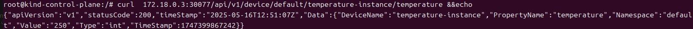

# 温度传感器 Modbus Mapper 插件

本项目是基于KubeEdge的Modbus协议温度传感器管理插件，实现了对温度传感器的数据采集、状态上报和控制功能。

## 功能特性

- 支持Modbus TCP和RTU通信模式
- 实现温度数据采集和上报
- 支持温度报警阈值设置
- 提供RESTful API接口进行设备控制和数据查询
- 支持设备状态实时监控

## 系统架构

本插件基于KubeEdge的Mapper框架开发，通过Modbus协议与温度传感器通信，实现设备数据的采集和控制。系统架构如下：

```
+------------------+      +------------------+      +------------------+
|                  |      |                  |      |                  |
|  温度传感器设备   | <--> |  Modbus Mapper   | <--> |  KubeEdge Edge   |
|  (Modbus Slave)  |      |     插件         |      |     Core        |
|                  |      |                  |      |                  |
+------------------+      +------------------+      +------------------+
                                    |
                                    | RESTful API
                                    |
                           +------------------+
                           |                  |
                           |    用户应用      |
                           |                  |
                           +------------------+
```

## 前置条件

- KubeEdge环境（v1.12.0或更高版本）
- Go 1.22.0或更高版本
- Modbus模拟软件（用于测试，如ModbusPal、Modbus Slave等）

## 快速开始

### 1. 克隆仓库到本地
```
git clone https://github.com/aAAaqwq/temperature-sensor-mapper
```

### 2.配置Modbus模拟软件(如果条件允许可以使用物理设备)
```
 安装modbus Slave(推荐)
    - 创建TCP/RTU设备连接,mapper默认使用TCP协议。
    - 配置Modbus寄存器：
        - 温度寄存器：保持寄存器，地址4000，数据类型：uint16
        - 工作状态寄存器：线圈寄存器，地址1001，数据类型：uint16
```

### 3. 配置mapper插件
 - 配置/crds/temperature-instance.yaml
 ```

 ```
 - 配置/resource/deployment.yaml
 ```
 ``` 
### 4. 编译和构建mapper插件镜像
```
export DOCKER_REGISTRY=<your_docker_registry>
make docker-build-push
```

### 5. 部署mapper和crds
```
make deploy
```
### 6. 验证插件功能
#### 6.1 查看twins字段中的reported字段同步:
```
kubectl get device -o yaml 
```
#### 6.2 在edgecore节点上访问mapper插件的REST API
- 健康检查
```
curl 127.0.0.1:7777/api/v1/ping 
```
- 获取设备状态
```
curl <your_edge_ip>:30077/api/v1/device/<namespace>/<device_name>/<property_name>
```


#### 6.3 查看mapper日志

### 7. 卸载插件
```
make clean
```

